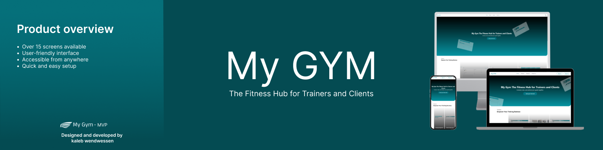
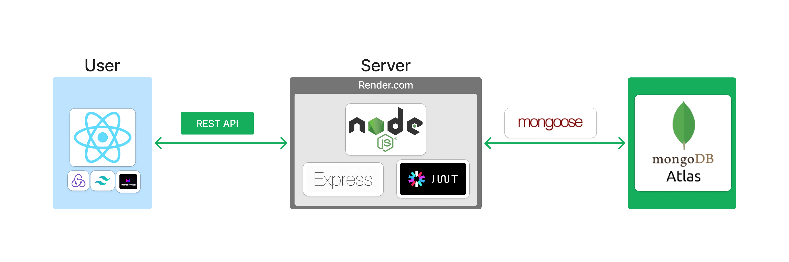
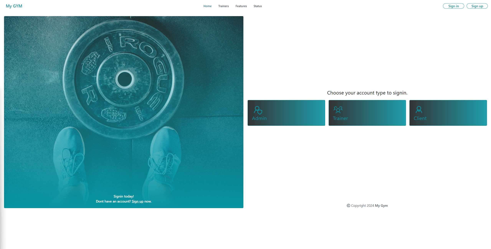
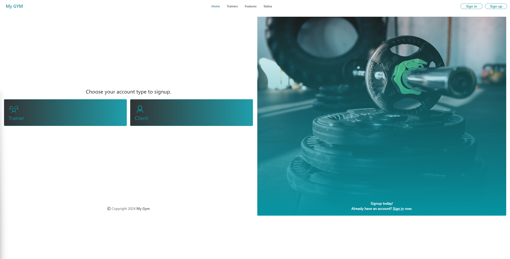
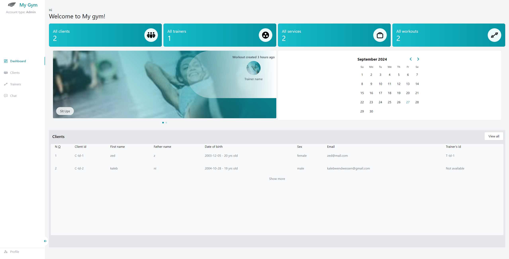
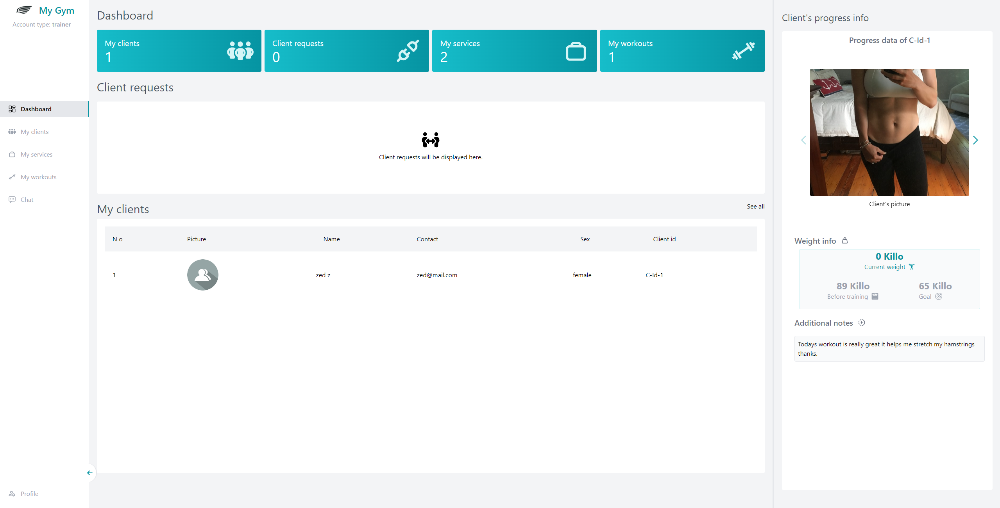
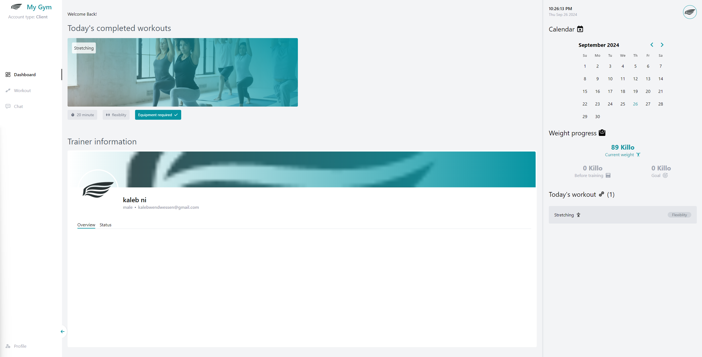

<p></p>

### Table of contents
* [Project name](#project-name)
* [Web app architechture](#web-app-architechture)
* [Introduction](#introduction)
* [Directories](#directories)
* [Installation](#installation)
* [Contributing](#contributing)
* [Related projects](#related-projects)
* [LICENSE](#license)

## Project name
# MY GYM - Fitness Hub (MVP)

## Web app architechture
<p> </p>

## Introduction
Welcome to the Minimum Viable Product (MVP) of MY GYM - Fitness Hub, an all-in-one platform for the gym community. Explore the live demo [here](https://my-gym.onrender.com/).
If you find this project interesting or have any feedback, feel free to connect with me on [LinkedIn](https://linkedin.com/in/kaleb-wendwessen). You can also read more about the development journey in [this article]().

## Directories
* [Frontend](./frontend/)
* [Backend](./backend/)

## Installation
To get started with this project, follow these steps:
```bash
# Clone the repository
   git clone https://github.com/leonileo/my_gym.git
   cd my_gym

# Install dependencies

#   If you're using npm
    npm install 

#   or if you're using yarn
    yarn install

# Create a .env file in the root directory and add the following environment variables
    NODE_ENV=ENVIRNOMENT
    PORT=PORT_NUMBER
    MONGO_URI=MONGO_URI
    JWT_SECRET=YOUR_SUPER_SAFE_JWT_SECRET

# Start the development server

#   To start both servers
    npm run dev
    
#   For frontend
    cd frontend
    npm run start

#   For backend
    cd backend
    npm run server
```

## Usage
### 1. Register an account or log in using the credentials provided in the demo.
### 2. Explore the features:
*   Access personalized workout plans.
*   Track your fitness progress.
*   Manage user profiles and gym memberships.
### 3. Admin Features:
*   Suspend user accounts.
*   Monitor user activity.
*   Create and assign workout plans for all users.

## Features showcased visually

### Sign in page
<p> </p>

### Sign up page
<p> </p>

### Admin dashboard page
<p> </p>

### Trainer dashboard page
<p> </p>

### Client dashboard page
<p> </p>

## Contributing
###### MVP
- Kaleb wendwessen - [Github](https://github.com/leonileo) / [Linkedin](https://linkedin.com/in/kaleb-wendwessen) 

## Related projects
- [TrueCoach](https://truecoach.co/)

## License
#### [MIT License](./LICENSE.txt)